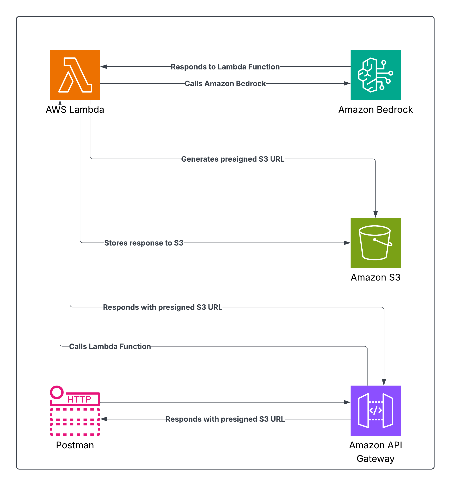

# 🧠 AWS Bedrock Dockerfile Generator

This project uses **Amazon Bedrock**, **AWS Lambda**, **API Gateway**, and **Amazon S3** to generate production-ready Dockerfiles using Gen-AI models. Everything is deployed using **Terraform Cloud**.

---

## 📌 Features

- Generate best-practice Dockerfiles for any programming language using Amazon Bedrock (Llama3).
- Store the generated Dockerfile in S3.
- Return a presigned URL to download the file.
- Full infrastructure-as-code using Terraform Cloud.

---

## 📐 Architecture Overview

Here's how the whole system works:

1. **Postman** sends a POST request to **API Gateway** with the programming language.
2. **API Gateway** triggers the **Lambda Function**.
3. **Lambda Function**:
   - Sends a prompt to **Amazon Bedrock**
   - Receives Dockerfile content
   - Stores the Dockerfile in **Amazon S3**
   - Generates a **presigned S3 URL**
   - Returns the URL back to API Gateway
4. **API Gateway** responds to **Postman** with the final download URL.

---

## 📦 Lambda Code

The Lambda function:
- Accepts `{ "language": "python" }` as input
- Generates a Dockerfile using Bedrock
- Saves it to S3
- Returns a presigned download URL

See [lambda/app.py](./lambda/app.py) for details.

---

## 🛠️ Technologies Used

- **Amazon Bedrock** - Gen-AI model invocation
- **AWS Lambda** - Serverless backend
- **Amazon S3** - File storage
- **API Gateway** - HTTP interface
- **Terraform Cloud** - Infra provisioning

---

## 🧠 From Idea to Execution

Read the full blog post with prompt debugging lessons, Bedrock quirks, and architecture breakdown here:  
👉 [Medium Blog](https://medium.com/@zlash65/build-a-gen-ai-dockerfile-generator-with-aws-bedrock-and-terraform-927f6aba0781)

---

## 📎 License

MIT

---

## 👤 Author

**Zlash65**  
[GitHub](https://github.com/Zlash65)
